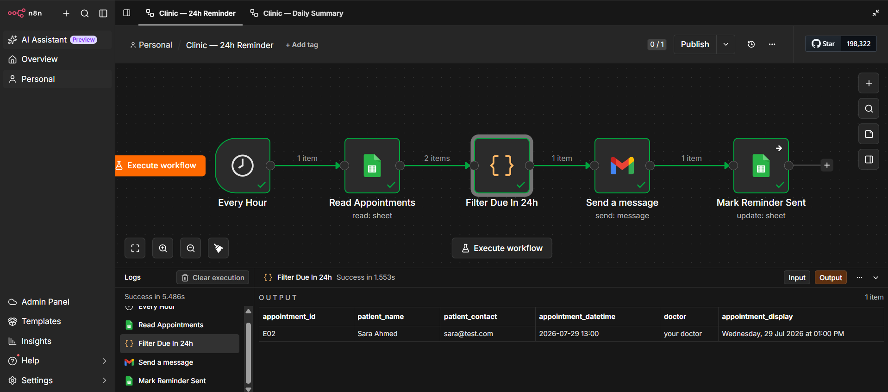
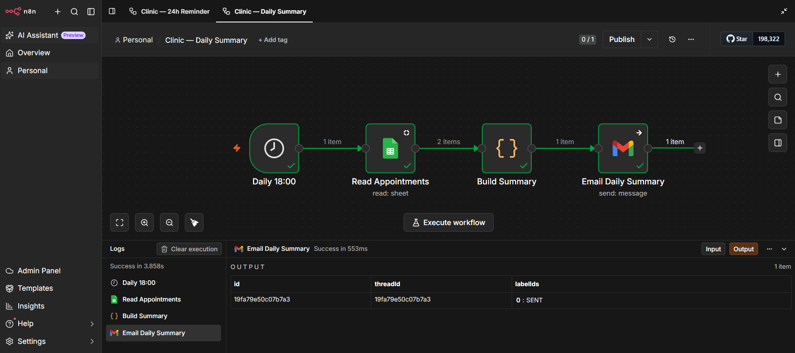

# Clinic Appointment Automation

Two connected n8n workflows that automate patient appointment 
reminders and daily staff reporting for a clinic — eliminating 
manual reminder calls and end-of-day reporting work.

## The Problem

Clinic staff spend time every day manually calling or messaging 
patients to remind them of upcoming appointments, and manually 
compiling a summary of the day's bookings and cancellations for 
the team.

## The Solution

Two workflows working together:

### 1. 24-Hour Appointment Reminder
Runs hourly, checks upcoming appointments, and automatically 
sends a reminder to any patient whose appointment falls within 
the next 24 hours — then marks it as sent so no patient is 
reminded twice.

**Flow:** Every Hour → Read Appointments → Filter Due in 24h → 
Send Reminder → Mark Reminder Sent

### 2. Daily Summary Report
Runs once a day (6 PM), compiles tomorrow's appointment count 
and today's cancellations, and emails a clean summary to clinic 
staff automatically.

**Flow:** Daily 18:00 → Read Appointments → Build Summary → 
Email Daily Summary

## Tech Stack

- **n8n** — workflow automation
- **Google Sheets** — appointment data storage and tracking
- **Gmail** — reminder delivery and staff notifications
- **JavaScript (Code node)** — date filtering and summary logic

## Result

Zero manual reminder calls, zero manual end-of-day reporting — 
staff time freed up for actual patient care.

## Status

Demo project built to showcase automation capability for AI 
agency services. Available for custom implementation — 
production deployment would connect to the clinic's real 
scheduling system and use WhatsApp/SMS via a verified business 
number.

## Setup

1. Import `24h-reminder-workflow.json` and 
   `daily-summary-workflow.json` into your n8n instance
2. Connect Google Sheets credentials (appointments sheet with 
   columns: patient_name, patient_contact, appointment_time, 
   status, reminder_sent)
3. Connect Gmail credentials
4. Publish/activate both workflows

---

Built by Husnain — AI Agency Developer  
[LinkedIn](https://www.linkedin.com/in/muhammad-husnain-fareed/) | [Agency Website](https://nainotech-solutions.lovable.app)
